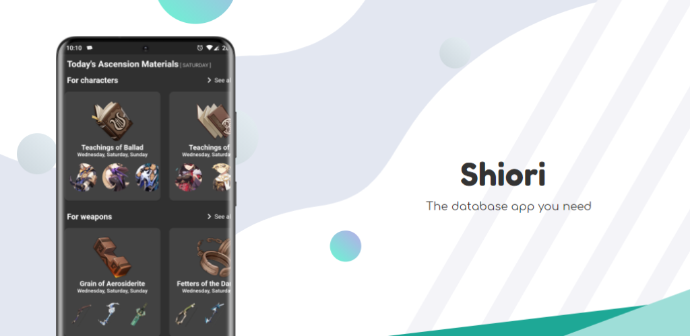

# Shiori

  

> A Genshin Impact database kinda app

> This app is not affiliated with or endorsed by miHoYo. Shiori is just a database app for the Genshin Impact game

  

### Features

* Artifacts
* Characters
* Weapons
* Materials
* And many more to come

### Contributing

> Before contributing, please ask me if whatever you are planning to do / add / improve is valid for this project.

You can build and run this thing by following these steps:

* Clone this repository
* Checkout the **develop** branch
* Run ``flutter pub get``
* Run ``flutter pub run build_runner build --delete-conflicting-outputs``
* Install the ``Flutter Intl extension`` (It is available in Vs Code and Android Studio)
* Run the ``flutter intl initialize`` command from your IDE
* Create a ``Secrets`` class in the infrastructure/telemetry folder and add a static property called ``appCenterKey`` (You could also comment the related code)
* Profit

### Translations

Currently the app supports English and Spanish (There are some folks working on a French / Russian translation).
If you want to help me with the translations, I encourage you to check the following files:

* The main one (where all the data of the characters / artifacts / etc. are stored):
[Main](https://github.com/Wolfteam/Shiori/blob/develop/assets/i18n/en.json)

* The general one (where common strings are stored [not related specifically to the game]):
[General](https://github.com/Wolfteam/Shiori/blob/develop/lib/l10n/intl_en.arb)

To translate the general one is very simple, create a copy of the file, keeping the keys and translate the values:
E.g (in spanish) : "dark" :"Oscuro"

The main one is where you will find all the data for all the weapons, artifacts, etc. 
To translate this file just create a copy of it and do the following:
There is a key called "key" for each character, weapon, etc, and this one does not require a translation, it's just there for convenience,
and the same applies here, just keep the keys and translate the values
E.g:  if I'm translating  "name": "Normal Attack"  to spanish it will look like this:  "name": "Ataque normal"

In this file, there are some translations (mainly for weapons) that look like this: "Increases DMG against enemies affected by Hydro or Pyro by {{0}}%",
The {{x}} is a placeholder and the value shouldn't be changed, but the position can be changed in the text. 

### Special Thanks

* To  [Uzair Ashraf](https://github.com/uzair-ashraf) for his wish simulator
* The folk(s) that developed the [Map](https://genshin-impact-map.appsample.com/#/)
* And the folks from [Honey Impact](https://genshin.honeyhunterworld), [Fandom Wiki](https://genshin-impact.fandom.com/wiki/Genshin_Impact), [Genshin.in](https://www.gensh.in/), [Genshin.Center](https://genshin-center.com/) that provide useful data

### Translators

Translating the app to other languages won't have been possible without the following contributors

|Chinese |Russian|Portuguese|Italian|Japanese|Vietnamese|Indonesian|
|---|---|---|---|---|---|---|
|2O48#9733|SipTik#8026|Brunoff#0261|Reniel [Skidex ツ]#7982|𝕽𝖚𝖗𝖎#3080|Ren Toky#5263|Arctara#7162|
| |KKTS#8567|DanPS#4336|Septenebris#7356||||
| |KlimeLime#7577||||||
| |Avantel#8880||||||
| |чебилин#5968||||||
| |Anixty#3279||||||
